  

## Eve

**AI Product Manager · Creator of「慢.说AI」**

我关注 AI 如何进入真实场景，成为用户愿意使用、能够信任的产品。

这里记录我的产品判断、实验过程与阶段性答案。

 

### Focus

| Product Thinking | Prototyping | Evaluation |
| :--- | :--- | :--- |
| 从用户问题和业务流程出发 | 把想法变成可体验的原型 | 用真实任务与失败案例验证 |

 

### Now

- 研究 Agent 与 AI 工作流的产品化
- 整理一套 AI 产品评测方法
- 完成第一个公开产品案例

 

### Principles

`问题先于能力`　`证据先于结论`　`体验先于功能`

 

### Contact

[小红书 · Eve](https://www.xiaohongshu.com/user/profile/634fb9e1000000001802b00f)　·　公众号「慢.说AI」
