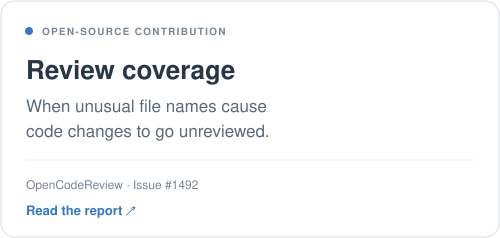
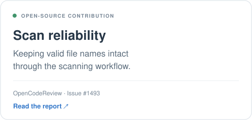
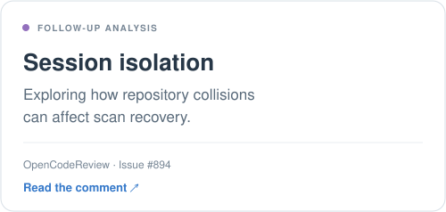
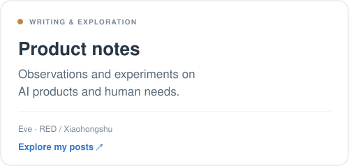

# Hi, I'm Eve 👋

Explore my product thinking, experiments, and open-source contributions below.

I'm an AI Product Manager exploring how AI fits into real workflows.\
I care about what people need, where systems fail, and how we can make them more useful.\
This is where I share what I'm building, testing, and learning.

🧪 [Selected work](#selected-work) · ✍️ [Writing](#writing) · 🌱 [About me](#about-me) · [RED / Xiaohongshu](https://www.xiaohongshu.com/user/profile/634fb9e1000000001802b00f)

---

## Selected work

Small, concrete contributions to more reliable AI products.

  <a href="https://github.com/alibaba/open-code-review/issues/1492"><picture><source media="(prefers-color-scheme: dark)" srcset="./review-coverage-dark.svg"></picture></a>
  <a href="https://github.com/alibaba/open-code-review/issues/1493"><picture><source media="(prefers-color-scheme: dark)" srcset="./scan-reliability-dark.svg"></picture></a>

  <a href="https://github.com/alibaba/open-code-review/issues/894#issuecomment-5748485061"><picture><source media="(prefers-color-scheme: dark)" srcset="./session-isolation-dark.svg"></picture></a>
  <a href="https://www.xiaohongshu.com/user/profile/634fb9e1000000001802b00f"><picture><source media="(prefers-color-scheme: dark)" srcset="./product-notes-dark.svg"></picture></a>

The OpenCodeReview contributions above are issue reports and a follow-up comment, prepared with AI assistance. They are not merged code fixes.

---

## Writing

I share observations on AI products, agents, and human–AI collaboration. I'm interested in the decisions behind a product: who it helps, what it gets wrong, and what makes it worth using.

- [Read my posts on RED / Xiaohongshu →](https://www.xiaohongshu.com/user/profile/634fb9e1000000001802b00f)
- I also write on WeChat about AI products and practical experiments.

---

## About me

- AI Product Manager with an interest in agents, AI workflows, and human–AI collaboration.
- Exploring product ideas through prototypes, evaluations, and open-source participation.
- Learning to turn observations into clear questions, testable assumptions, and better product decisions.
- Building a public record of what I try, what I learn, and what I change my mind about.

**Build** something useful · **Test** it in context · **Learn** from evidence · **Improve** with feedback

Think carefully. Build with purpose. Keep learning.
